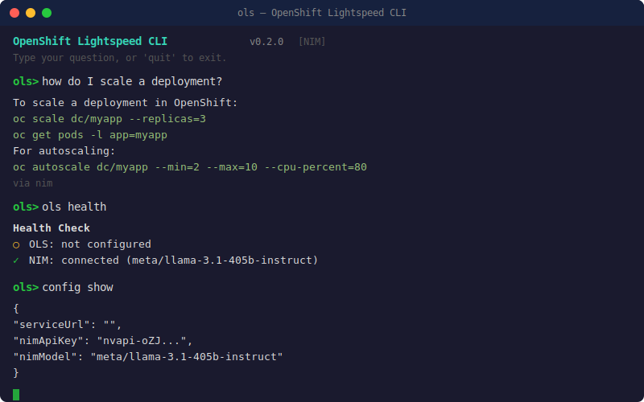

# ⚡ OpenShift Lightspeed CLI

AI-powered OpenShift assistant from your terminal. Ask questions, troubleshoot, and manage your cluster — powered by OLS and NVIDIA NIM.

[](https://www.npmjs.com/package/@ols-cli/lightspeed) [](https://www.npmjs.com/package/@ols-cli/lightspeed) [](LICENSE)



## Install

```bash
npm install -g @ols-cli/lightspeed
```

## Quick Start

```bash
# Configure NVIDIA NIM (works immediately, no OLS needed)
ols config set nimApiKey nvapi-your-key-here
ols config set nimModel meta/llama-3.1-405b-instruct

# Or configure OLS (if you have Lightspeed Service on your cluster)
ols config set serviceUrl https://lightspeed-service.openshift-operators.svc:8443

# Start chatting
ols
```

## Usage

```bash
ols                              # Interactive REPL
ols "how do I scale?"            # One-shot query
ols health                       # Check backend health
ols conversations                # List OLS conversations
ols config show                  # Show configuration
ols config set <key> <value>     # Set config
ols help                         # Help
```

## Backends

| Backend | Setup | Description |
|---------|-------|-------------|
| **OLS** | `ols config set serviceUrl <url>` | OpenShift Lightspeed Service (cluster-deployed, RAG with OCP docs) |
| **NIM** | `ols config set nimApiKey <key>` | NVIDIA NIM — OpenAI-compatible LLM (works without OLS) |

OLS is tried first, NIM is the fallback. Either one works standalone.

## Config

Stored at `~/.ols/config.json`:

```json
{
  "serviceUrl": "https://lightspeed-service.openshift-operators.svc:8443",
  "nimApiKey": "nvapi-xxxxx",
  "nimModel": "meta/llama-3.1-405b-instruct",
  "nimBaseUrl": "https://integrate.api.nvidia.com"
}
```

| Key | Default | Description |
|-----|---------|-------------|
| `serviceUrl` | `""` | OLS service URL |
| `nimApiKey` | `""` | NVIDIA NIM API key |
| `nimModel` | `nvidia/llama-3.1-nemotron-70b-instruct` | NIM model name |
| `nimBaseUrl` | `https://integrate.api.nvidia.com` | NIM API base URL |

## Auth

- **OLS**: K8S bearer token from kubeconfig (`oc login`)
- **NIM**: API key (no kubeconfig needed)

## Examples

```bash
$ ols "what is OpenShift Lightspeed?"

OpenShift Lightspeed (OLS) is an AI-powered assistant that runs on
OpenShift clusters. It uses LLM backends with RAG-indexed OpenShift
documentation to answer questions about cluster operations.

via nim

$ ols "how do I scale a deployment?"

To scale a deployment in OpenShift:

  oc scale dc/myapp --replicas=3
  oc get pods -l app=myapp

For autoscaling:
  oc autoscale dc/myapp --min=2 --max=10 --cpu-percent=80

via nim
```

## Packages

| Package | npm | Description |
|---------|-----|-------------|
| `@ols-cli/lightspeed` | [](https://www.npmjs.com/package/@ols-cli/lightspeed) | CLI tool |
| `@ols-cli/client` | [](https://www.npmjs.com/package/@ols-cli/client) | OLS REST API + NIM client |

## Requirements

- Node.js >= 20.6.0
- OLS service URL **or** NVIDIA NIM API key
- `oc` CLI (for OLS auth via kubeconfig)

## License

Apache-2.0
